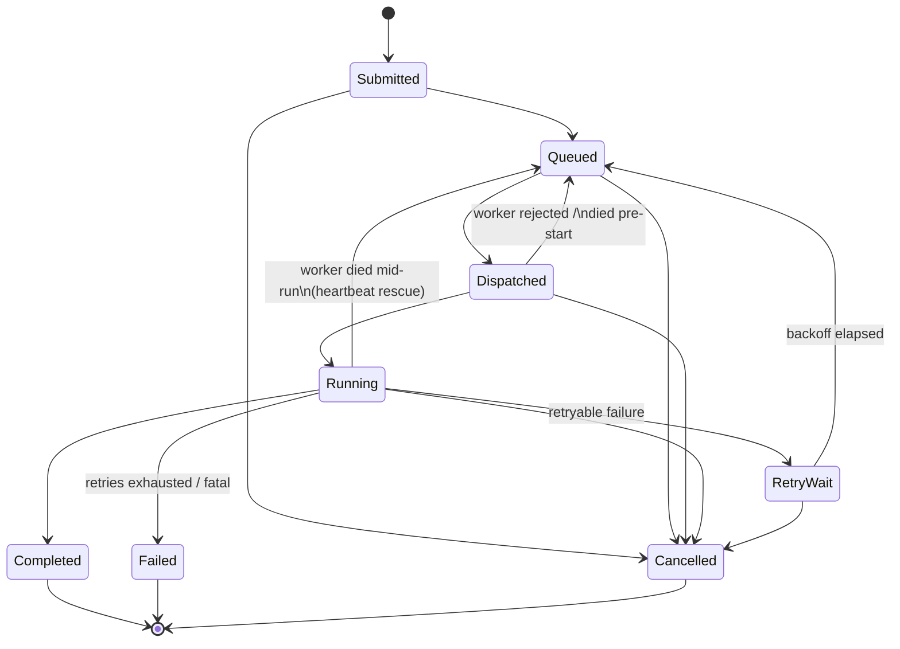
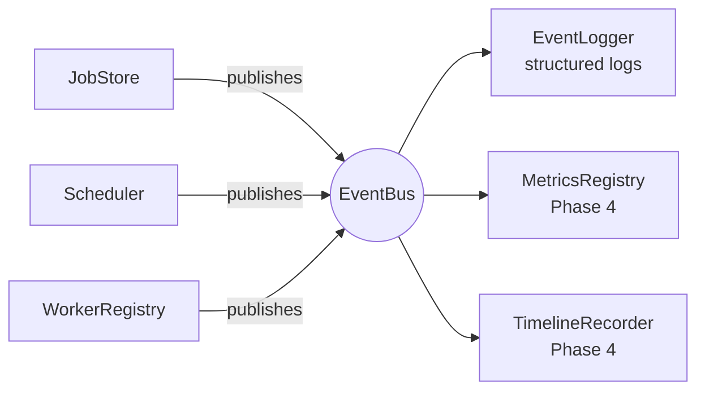

# CHRONOS Architecture

CHRONOS is a production-inspired task scheduling and execution engine:
resource-aware, policy-pluggable scheduling over a fleet of workers, with
fault tolerance and first-class observability. The execution backend is
threads-in-one-process today, designed so that remote workers over gRPC are
a transport swap, not a redesign.

## Module map

```
chronos::core            Job, JobStore (state machine), Clock, EventBus, ids
chronos::scheduling      Policies (FIFO/Priority/EDF/Composite), ReadySet,
                         RetryManager, Scheduler (the loop, backfill)
chronos::execution       ExecutionBackend + SchedulerClient (the seam),
                         WorkerRegistry, LocalThreadBackend
chronos::observability   structured log, EventLogger, MetricsRegistry
                         (+ Prometheus exposition), SchedulerMetrics,
                         TimelineRecorder
chronos::sim             deterministic discrete-event simulator over the
                         production scheduler
chronos::api             zero-dependency JSON + HTTP/1.1 server + REST
                         routes; serves the static dashboard
apps/                    chronosd daemon, chronos-sim, chronos-bench,
                         day demos
```

Dependency rule: `core` depends on nothing but the standard library.
`scheduling` and `execution` depend on `core`. `observability` attaches via
EventBus subscriptions — the core never references it.

## Job lifecycle



Enforced at runtime by `JobStore::transition()`; the full 8×8 matrix is
unit-tested. See [ADR-003](decisions/ADR-003-job-state-machine.md).

## Event flow



Synchronous, causally ordered delivery — see
[ADR-002](decisions/ADR-002-synchronous-event-bus.md).

## Scheduling & execution design (as built)

- **Push-based dispatch from a single scheduler thread** owning all
  scheduling state; everything else communicates via a command queue.
  Dispatch pairs (best eligible job) × (most-free-CPU worker) and pushes a
  `JobAssignment` into the worker's inbox — the in-process stand-in for a
  per-worker gRPC stream (ADR-006).
- **The distributed seam**: `ExecutionBackend::dispatch()` downward,
  `SchedulerClient::{report_started, report_completion, report_heartbeat}`
  upward. Workers are registry records, never threads.
- **Fault tolerance**: sidecar heartbeats; lease-timeout death detection;
  orphan rescue that distinguishes never-started (attempt preserved) from
  died-mid-run (attempt consumed); permanent death to avoid split-brain;
  stale reports bounce off the state machine (ADR-007).
- **Backfill reservations**: a repeatedly-skipped queue head freezes the
  biggest worker that could ever host it, bounding large-job starvation
  while smaller jobs backfill the remaining fleet (ADR-007).
- **Deterministic core**: the whole iteration is `run_once(now)` — unit
  tests and the simulator drive the production scheduler on simulated time.

## Build phases

| Phase | Contents | Status |
|---|---|---|
| 1 | Repo, CI, Clock, Job/JobStore state machine, EventBus, logging, tests | ✅ done |
| 2 | Policies (FIFO/Priority/EDF/Composite), ReadySet + re-scoring, RetryManager, skip-tracking (backfill foundation) | ✅ done |
| 3 | Scheduler loop (push dispatch), WorkerRegistry + resource accounting, LocalThreadBackend, heartbeats + rescue, backfill reservations | ✅ done |
| 4 | MetricsRegistry + Prometheus exposition, SchedulerMetrics, TimelineRecorder, deterministic simulator, benchmarks | ✅ done |
| 5 | REST API (`chronos::api`), live dashboard, chronosd daemon, Docker | ✅ done |
| 6 | Stress tests, sanitizer hardening, docs polish | |

## Quality gates

- `-Wall -Wextra -Wpedantic -Wconversion -Wshadow …` with `-Werror`.
- Every merge runs the full suite under Debug, Release, ASan+UBSan, and TSan
  in CI (`.github/workflows/ci.yml`).
- All time-dependent logic tested deterministically via `SimulatedClock`
  ([ADR-001](decisions/ADR-001-clock-injection.md)).
- Scheduling design records: [ADR-004 (ReadySet)](decisions/ADR-004-ready-set.md), [ADR-005 (retry semantics)](decisions/ADR-005-retry-semantics.md), [ADR-006 (push dispatch & the backend seam)](decisions/ADR-006-push-dispatch-backend-seam.md), [ADR-007 (liveness, rescue, backfill)](decisions/ADR-007-liveness-rescue-backfill.md), [ADR-008 (observability)](decisions/ADR-008-observability.md), [ADR-009 (simulator)](decisions/ADR-009-simulator.md).
- API & dashboard: [ADR-010 (zero-dependency HTTP)](decisions/ADR-010-zero-dependency-http.md).
- Measured results: [benchmarks.md](benchmarks.md).
